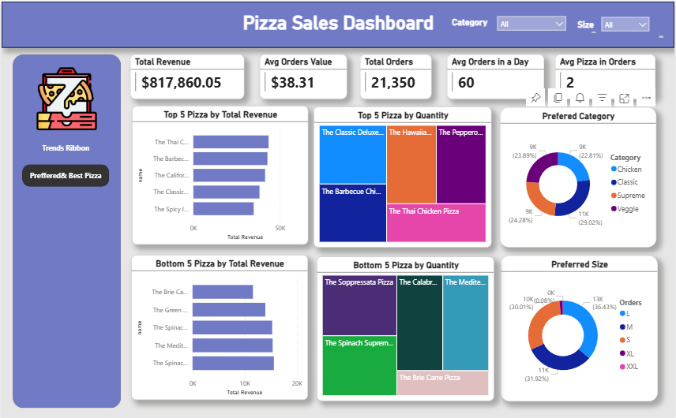

# Pizza Sales Dataset Analysis

# Overview Project
This project analyzes pizza sales data using SQL for data querying and Power BI for visualization. The dataset used includes order details such as date, time, quantity, price, category, and pizza size. The analysis focuses on calculating important Key Performance Indicators and creating interactive charts to understand sales trends, customer preferences, and performance metrics. The goal of this project is to help pizza businesses optimize operations, identify best-selling products, and find areas for improvement. 

# Problem Statement
1. How many customers do we have each day? Are there any peak hours?
2. How many pizzas are typically in an order? Do we have any bestsellers?
3. How much money did we make this year? Can we indentify any seasonality in the sales?
4. Are there any pizzas we should take of the menu, or any promotions we could leverage?

# Objective
1. Identify the number of customers each day and find the peak sales hours.
2. Find out the average number of pizzas in each order and determine the best-selling menu items.
3. Calculate total revenue for the year and analyze seasonal patterns in sales.
4. Evaluate less popular pizza menu items and formulate potential promotional strategies to increase sales.

# Dataset
Link : https://mavenanalytics.io/data-playground/pizza-place-sales

# Tools
1. SQL
2. Power BI

# Key Findings
1. Total Revenue : $ 817,860
2. Avg Order Value (AOV) : $ 38.31
3. Total Orders : 21,350
4. Avg Order in a Day : 60
5. Avg Pizza in Order : 2

# Power BI Dashboard
The Dashboard shows:
- KPI cards for revenue, orders, and averages, with slicers categories, and sizes
- Charts: Bar for daily orders, line for hourly trends, pie for preffered category/size
- Bar charts highlight top/bottom 5 sellers by revenue, quantity, enabling dynamic filtering for insights

# Conclusions
1. The number of customers is listed on the **Peak Day chart**, where the busiest day is **Friday**, and the peak hours are **12-3 PM**.
2. On average, customers order **2 pizzas per order**. The bestseller category is **'Classic,'** and the most popular pizza size is **'L'.**
3. The company's total revenue this year is **$817,860**, and the seasonal peak occurs in **July**, where pizza orders reach their maximum.
4. It's known that 'The Brie Carre Pizza' is in the bottom 5 for both total revenue and quantity, and the top 5 are 'Thai Chicken Pizza' and 'The Classic Deluxe Pizza' for both total revenue and quantity.

# Recommendations
1. Prioritize promotions on Fridays and between 12 PM and 3 PM, as these are peak days and peak hours.
2. Maintain the Classic Pizza variant as the flagship product, as it is the most popular category.
3. Encourage sales of the L size, for example with a “Buy 1 Get 1” promotion or family packages, as these are the most in demand.
4. Consider reducing or innovating the recipe for The **Brie Carre Pizza** because its performance is **low** in terms of both **revenue and quantity.**
5. Create a special seasonal campaign ahead of July to maximize peak sales momentum.
6. Enhance your cross-selling strategy by offering a 2-pizza bundle based on the average customer order.
